---
layout: default
---  

# _Quem sou eu_
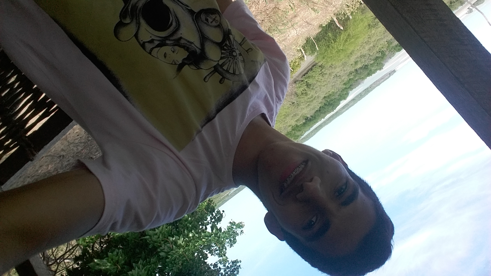

Me chamo Jefferson Leocardo, sou programador de jogos digitais, estudo no
instituto federal de Educação de Educação Ciencia e Tecnologia do 
Rio Grande do Norte "IFRN" Campus Ceará-Mirim/RN

**"Quem muito te critica, no fundo te admira. Fé em Deus que ele é justo"**

***

# _Contatos_

* Email: jeffersonaraujo141@gmail.com
* Email Acadêmico : jefferson.araujo@escolar.ifrn.edu.br
* Facebook : [Jefferson Araujo](https://www.facebook.com/profile.php?id=100005695811266/)
* Instagram : [jeffersonaraujo141](https://www.instagram.com/jeffersonaraujo141/)

***

# _Games_

* Mais rápido que a música 

**Parceiros:** [Guilherme Eglé](https://guiegle.github.io/) e  [João Kennedy Oliveira](https://kkenedy.github.io/)
[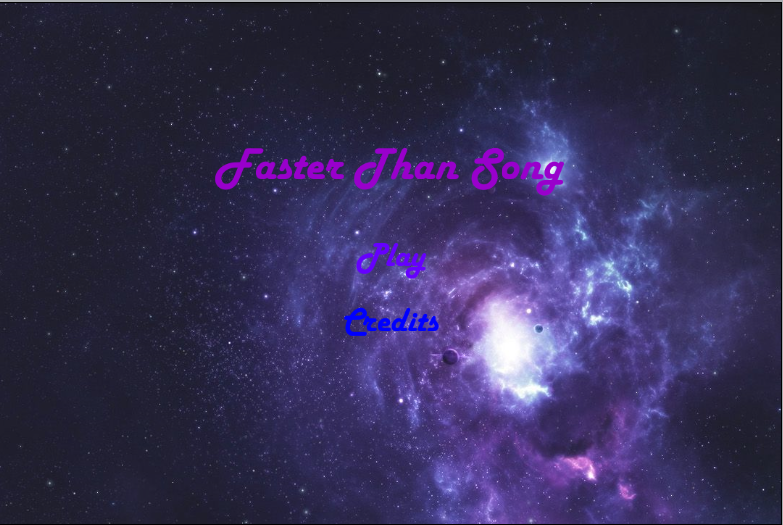](https://jefferson141.github.io/Faster%20Than%20Song/)

* A missão do mensageiro

**Parceiro:** [Felipe Castro](https://felipecastroifrn.github.io/)
[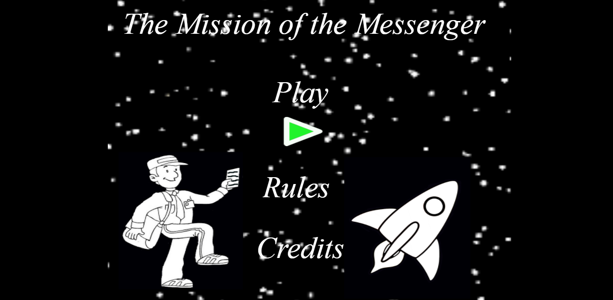](https://jefferson141.github.io/A%20miss%C3%A3o%20do%20Mensageiro/)

* Pense se você puder

**Parceiros:** [João Kennedy Oliveira](https://kkenedy.github.io/) e [Julio Cesar Oliveira](https://cesarabc45.github.io/)
[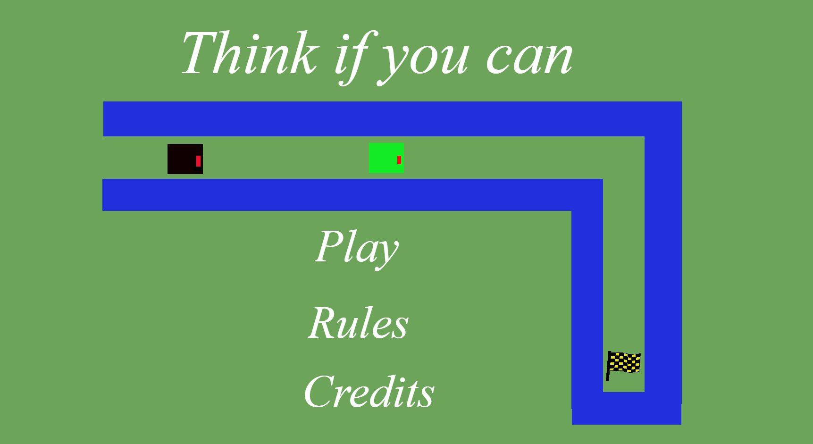](https://jefferson141.github.io/Pense%20se%20voc%C3%AA%20puder/)

***

# _Artes_

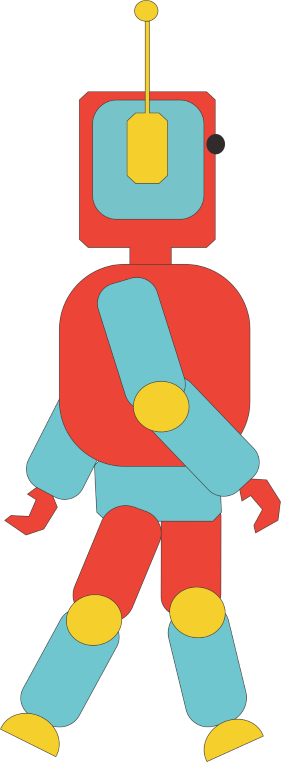   

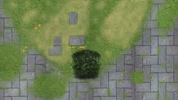

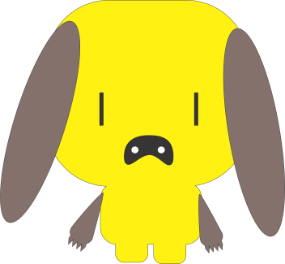

***

# _Animações_

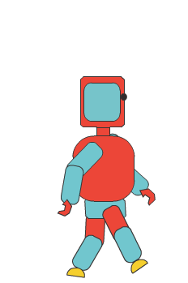  -.gif)  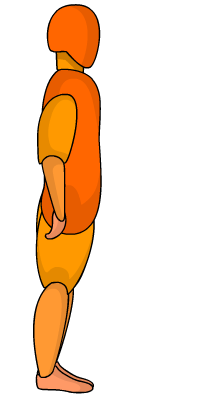

***

# _Projetos Desenvolvidos_

* **Projeto Integrador(PI) - MATEMÁTICA NA CRIAÇÃO DE RPG´S**

*  **Orientador(a) :** Daniela Beny

  

* **Projeto Integrador(PI) - Torre Defence**

*  **Orientador(a) :** [Marcelo Barros](http://marcelomesmo.github.io/)

 

***

# _Trabalhos_

**Influence map**
* Para ajudar na criação dos nossos jogos e manter a criatividade no desenvolvimento, criamos nosso próprio
influence map que serviu de estimulo para ampliar a crição de novos jogos.

**Mockup**
* Desenvolvemos um mockup de um jogo e também um aúdio. Todas as artes tinham que serem feitas em Pixel, 
com as dimensões 16X16 e com um tamanho de tela com dimensões 320x180. Eu e meu parceiro de trabalho, montamos nosso
Mockup no Construct 2, fizemos todas as artes pelo Piskel e criamos o aúdio pelo Audacity.

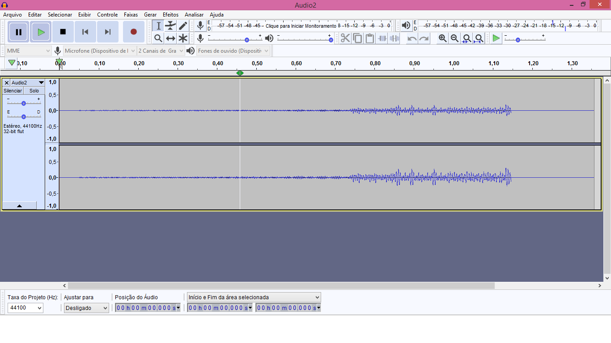

[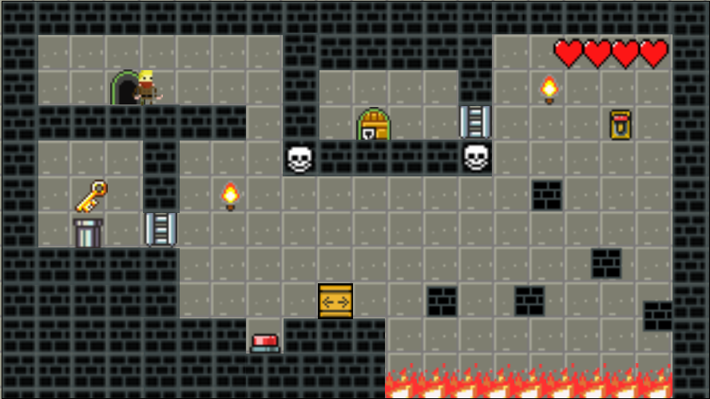](https://jefferson141.github.io/Mockup/)
**Parceiro:** [Tailson Ferreira](https://tayllson.github.io/)   
**Disciplina:** Oficina e Criação de personagens

**Tutorial Multiplos Idiomas**
[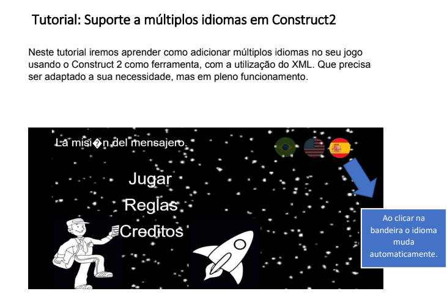](https://drive.google.com/open?id=1bczwvJeXzpCUOJeaYsit2PXPMRPebd5P)   
**Parceiros:** [João Kennedy Oliveira](https://kkenedy.github.io/) e [Julio Cesar Oliveira](https://cesarabc45.github.io/)   
**Disciplina:** Motores de Jogos

* A calculadora foi um trabalho desenvolvido na materia de matemática com o intuito de juntar a programação com a matéria
propedêutica. E desenvolvemos a programação em C++.  
[Calculadora em c++](https://drive.google.com/open?id=0B3htAGIN8ng2ZC1yQjZ6NUNuVTZYM29FS3FtWlRieXZ0U05r)   
**Parceiros:**   [Franklin Mateus](https://thewordkh.github.io/), [João Kennedy Oliveira](https://kkenedy.github.io/), [João Victor](https://juvito.github.io/), [Lucas Emannuell](https://lucas-manolo.github.io/)
**Disciplina:** Matemática
