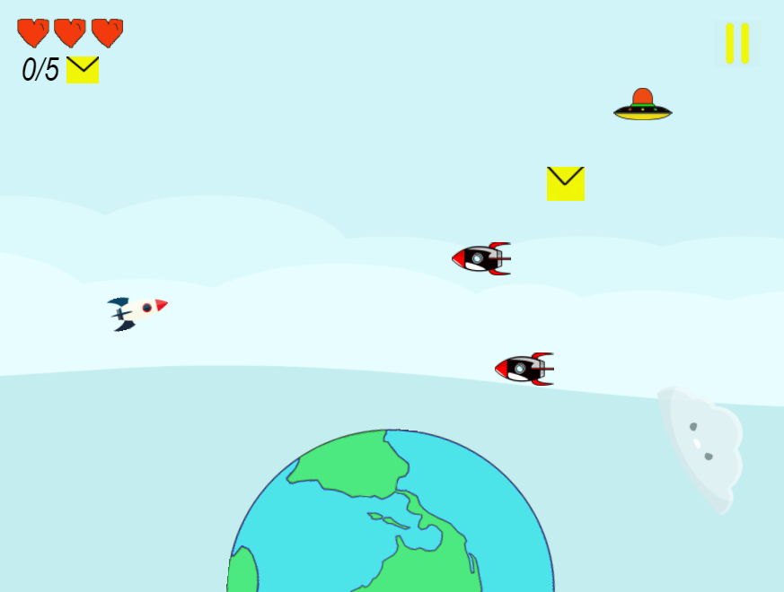

Criando **minha**, _página_, ~~principal~~.

# Quem sou eu

Me chamo Jefferson Leocardo, sou programador de jogos digitais, estudo no instituto federal de Educação de Educação Ciencia e Tecnologia do Rio Grande do Norte "IFRN" Campus Ceará-Mirim/RN

***

# Contatos

* Email: jeffersonaraujo141@gmail.com
* Facebook : Jefferson Araújo
* Instagram : jeffersonaraujo141

***

## Games
* A missão do mensageiro

* Pense se você puder

***

# Artes

**Fase 1**

**Fase 2**

**Influence map**

***

# Apresentações
* **Jogo 1** - A missão do mensageiro - É um jogo touch, pode ser jogado em smartphones ou PC's. O jogo tem como objetivo fazer com que a nave pegue cartas para poder passar de fase, na primeira fase temos que pegar 5 cartas amarelas que conta como pontuação, devemos desviar dos inimigos e obstáculos para não perdermos. Já na segunda fase temos que pegar 20 cartas para poder vencer.

* **Jogo 2** - Pense se você puder - É um jogo touch, pode ser jogado em Smartphones ou PC's. O jogo tem como principal objetivo fazer com que o jogador passe por um labirinto cheio de inimigos sem que eles o toque, até chegar na bandeirinha. Se os inimigos encostarem no personagem você perderá. Controlamos o personagem clicando nas teclas "Para cima, para baixo, lado esquero e direito".

* * *

** negrito
_ italico
~~ riscado
  dois espaços p/ pular linha
3* adiciona uma linha horizontal
#s uma ou mais hasthags criam capítulos ou sub capítulos
*s adiciona uma lista não numerada
1s numeros adicionam uma lista numerada

* * *

